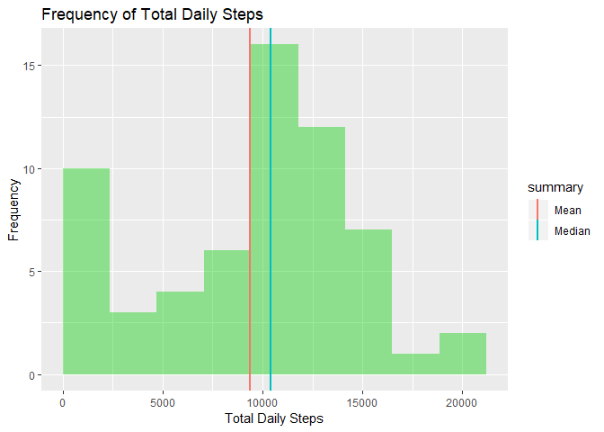
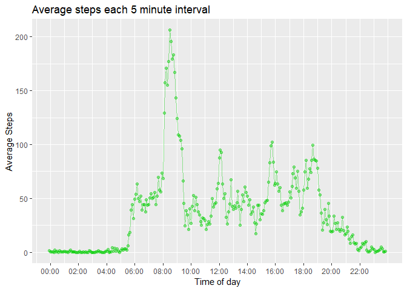
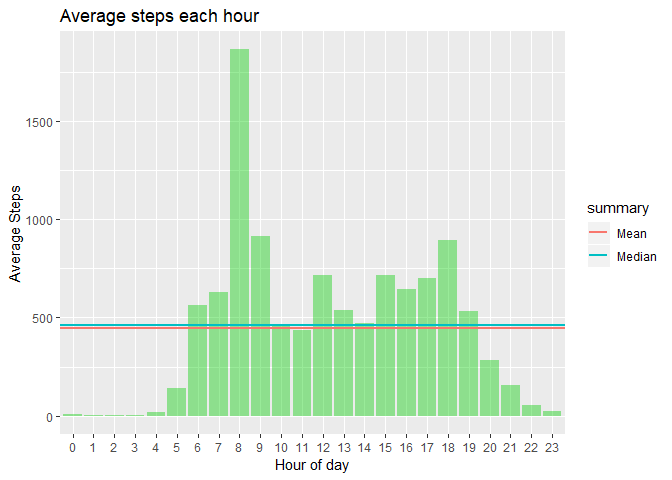
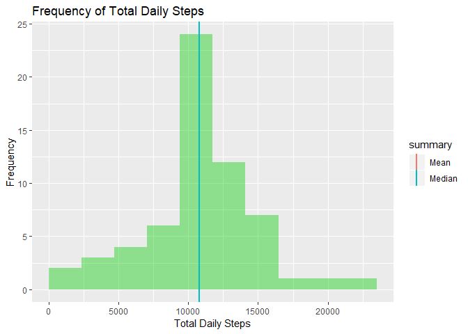
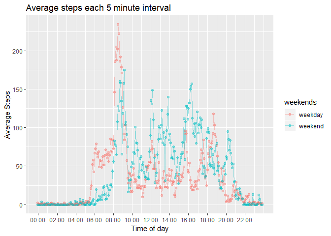
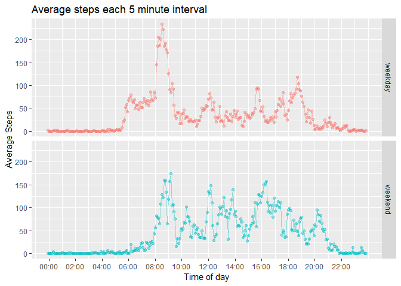

Loading required packages
-------------------------


```r
library(ggplot2)
library(dplyr)
library(reshape2)
library(stringr)
```


Loading the data
----------------

Data can be found in this [GitHub repositry](https://github.com/benegd/RepData_PeerAssessment1)


```r
data <- read.csv(unz("activity.zip", "activity.csv"))
```

Reviewing summary data about the dataset
----------------------------------------

Preforming some basic functions to get a better idea of the dataset. 


```r
dim(data)
```

```
## [1] 17568     3
```

```r
summary(data)
```

```
##      steps                date          interval     
##  Min.   :  0.00   2012-10-01:  288   Min.   :   0.0  
##  1st Qu.:  0.00   2012-10-02:  288   1st Qu.: 588.8  
##  Median :  0.00   2012-10-03:  288   Median :1177.5  
##  Mean   : 37.38   2012-10-04:  288   Mean   :1177.5  
##  3rd Qu.: 12.00   2012-10-05:  288   3rd Qu.:1766.2  
##  Max.   :806.00   2012-10-06:  288   Max.   :2355.0  
##  NA's   :2304     (Other)   :15840
```


```r
str(data)
```

```
## 'data.frame':	17568 obs. of  3 variables:
##  $ steps   : int  NA NA NA NA NA NA NA NA NA NA ...
##  $ date    : Factor w/ 61 levels "2012-10-01","2012-10-02",..: 1 1 1 1 1 1 1 1 1 1 ...
##  $ interval: int  0 5 10 15 20 25 30 35 40 45 ...
```

Important notes from summary

* There is a NA data in the steps

* The date is currently a factor

* Interval is set up as an interger, number of minutes past midnight

Cleaning the data
-----------------

Only modification I will preform is the change of date from a factor to date


```r
data$date <- as.Date(data$date, format = "%Y-%m-%d")
class(data$date)
```

```
## [1] "Date"
```

Mean steps taken per day
------------------------

Calculating the mean and median total number of steps taken per day


```r
totaldailysteps <- data %>% group_by(date) %>% summarise(sum = sum(steps, na.rm = TRUE))
head(totaldailysteps)
```

```
## # A tibble: 6 x 2
##   date         sum
##   <date>     <int>
## 1 2012-10-01     0
## 2 2012-10-02   126
## 3 2012-10-03 11352
## 4 2012-10-04 12116
## 5 2012-10-05 13294
## 6 2012-10-06 15420
```


```r
#summary(totaldailysteps)[,2][3:4]
totalsum <- data.frame(Mean = mean(totaldailysteps$sum), Median = median(totaldailysteps$sum))
totalsum <- melt(totalsum)
```

```
## No id variables; using all as measure variables
```

```r
colnames(totalsum) <- c("summary", "total")
totalsum
```

```
##   summary    total
## 1    Mean  9354.23
## 2  Median 10395.00
```


Note that there are still Na and NaN values on days where there is no data

###Plotting a histogram of the total steps taken each day


```r
p <- ggplot(totaldailysteps, aes(x = sum))
p <- p +geom_histogram( bins = 10, fill = 3, boundary = 0, alpha = 0.4)
p <- p + labs( x = "Total Daily Steps")
p <- p + labs(y = "Frequency")
p <- p + ggtitle("Frequency of Total Daily Steps")
p <- p + geom_vline(data = totalsum, mapping = aes(xintercept = total, color = summary), size = 1)
#p <- p + geom_vline(xintercept = totalsum$Mean, show.legend = TRUE, colour = 3, size = 1)
#p <- p + geom_vline( xintercept = totalsum$Median, show.legend = TRUE, colour = 4, size = 1)
p <- p + theme(legend.position = "right")
p
```

<!-- -->


Average daily activity pattern
------------------------------

Looking at the average activity in each interval of the day.

Creating the averages for ploting and adding bins for each hour.


```r
activityperperiod <- data %>% group_by(interval) %>% summarise(mean = mean(steps, na.rm = TRUE))
activityperperiod$hour <- cut(activityperperiod$interval, 24, labels = 0:23)
head(activityperperiod, 14)
```

```
## # A tibble: 14 x 3
##    interval   mean hour 
##       <int>  <dbl> <fct>
##  1        0 1.72   0    
##  2        5 0.340  0    
##  3       10 0.132  0    
##  4       15 0.151  0    
##  5       20 0.0755 0    
##  6       25 2.09   0    
##  7       30 0.528  0    
##  8       35 0.868  0    
##  9       40 0      0    
## 10       45 1.47   0    
## 11       50 0.302  0    
## 12       55 0.132  0    
## 13      100 0.321  1    
## 14      105 0.679  1
```

You can see by this data that the intervals are programed as HourMinute not a cumlative minutes. 

Adding an extra field that shows the interval as the total minutes so it makes more sense on a plot.


```r
activityperperiod$intinmins <- with(activityperperiod, sapply(interval, function(x){x-40*floor(x/100)}))
head(activityperperiod, 14)
```

```
## # A tibble: 14 x 4
##    interval   mean hour  intinmins
##       <int>  <dbl> <fct>     <dbl>
##  1        0 1.72   0             0
##  2        5 0.340  0             5
##  3       10 0.132  0            10
##  4       15 0.151  0            15
##  5       20 0.0755 0            20
##  6       25 2.09   0            25
##  7       30 0.528  0            30
##  8       35 0.868  0            35
##  9       40 0      0            40
## 10       45 1.47   0            45
## 11       50 0.302  0            50
## 12       55 0.132  0            55
## 13      100 0.321  1            60
## 14      105 0.679  1            65
```

Adding a field that display like a time

```r
converttime <- function(x){
        hour <- as.character(floor(x/100)) 
        hour <- str_pad(hour, 2, side = "left", pad = "0")
        min <- as.character(x -(floor(x/100)*100))
        min <- str_pad(min, 2, side = "left", pad = "0")
        paste(hour, min, sep = ":")
}
activityperperiod$intastime <- as.factor(with(activityperperiod, sapply(interval, converttime)))
head(activityperperiod)
```

```
## # A tibble: 6 x 5
##   interval   mean hour  intinmins intastime
##      <int>  <dbl> <fct>     <dbl> <fct>    
## 1        0 1.72   0             0 00:00    
## 2        5 0.340  0             5 00:05    
## 3       10 0.132  0            10 00:10    
## 4       15 0.151  0            15 00:15    
## 5       20 0.0755 0            20 00:20    
## 6       25 2.09   0            25 00:25
```

Some summary data


```r
summary(activityperperiod$mean)
```

```
##    Min. 1st Qu.  Median    Mean 3rd Qu.    Max. 
##   0.000   2.486  34.113  37.383  52.835 206.170
```

The interval with the maximum steps

```r
with(activityperperiod, activityperperiod[mean == max(mean, na.rm = TRUE),])
```

```
## # A tibble: 1 x 5
##   interval  mean hour  intinmins intastime
##      <int> <dbl> <fct>     <dbl> <fct>    
## 1      835  206. 8           515 08:35
```


Plot of average steps throughout the day


```r
p <- ggplot(activityperperiod, aes(x=intinmins, y = mean))
p <- p + geom_line(color = 3, alpha = 0.4)
p <- p + geom_point(color = 3, alpha = 0.4)
p <- p + labs( x = "Time of day")
p <- p + labs(y = "Average Steps")
p <- p + ggtitle("Average steps each 5 minute interval")
xticks <- seq(from = 1, to = nrow(activityperperiod), by = 24)
p <- p + scale_x_continuous(breaks = xticks*5, labels = activityperperiod$intastime[xticks])
p
```

<!-- -->

Hourly summary data


```r
totalsum <-activityperperiod %>% group_by(hour) %>% summarise(sum = sum(mean, na.rm = TRUE))
totalsum <- melt(summarise(totalsum, Mean = mean(sum, na.rm = TRUE), Median = median(sum, na.rm = TRUE)))
```

```
## Warning: package 'bindrcpp' was built under R version 3.5.1
```

```
## No id variables; using all as measure variables
```

```r
colnames(totalsum) <- c("summary", "total")
totalsum
```

```
##   summary    total
## 1    Mean 448.5912
## 2  Median 463.5377
```

Plotting the activity as a bar graph over time for each hour


```r
p <- ggplot(activityperperiod, aes(x=hour, y = mean))
p <- p + geom_bar(stat = "identity", fill = 3, alpha = 0.4)
p <- p + labs( x = "Hour of day")
p <- p + labs(y = "Average Steps")
p <- p + ggtitle("Average steps each hour")
p <- p + geom_hline(data = totalsum, mapping = aes(yintercept = total, color = summary), size = 1)
p
```

<!-- -->


Inputing missing values
-----------------------

Replacing the NA values with the average value for the time interval


```r
data$nonasteps <- rep(activityperperiod$mean, length(unique(data$date)))
nasteps <- function(x){
        if(is.na(x["steps"])){
                x["nonasteps"]
        }else {
                x["steps"]
        }
}
data$nonasteps <- as.numeric(apply(data, 1, nasteps))
head(data)
```

```
##   steps       date interval nonasteps
## 1    NA 2012-10-01        0 1.7169811
## 2    NA 2012-10-01        5 0.3396226
## 3    NA 2012-10-01       10 0.1320755
## 4    NA 2012-10-01       15 0.1509434
## 5    NA 2012-10-01       20 0.0754717
## 6    NA 2012-10-01       25 2.0943396
```

Calculating the mean and median total number of steps taken per day


```r
totaldailysteps <- data %>% group_by(date) %>% summarise(sum = sum(nonasteps, na.rm = TRUE), ogsum = sum(steps, na.rm = TRUE))
head(totaldailysteps)
```

```
## # A tibble: 6 x 3
##   date          sum ogsum
##   <date>      <dbl> <int>
## 1 2012-10-01 10766.     0
## 2 2012-10-02   126    126
## 3 2012-10-03 11352  11352
## 4 2012-10-04 12116  12116
## 5 2012-10-05 13294  13294
## 6 2012-10-06 15420  15420
```


```r
totalsum <- data.frame(Mean = mean(totaldailysteps$sum), Median = median(totaldailysteps$sum))
head(totalsum)
```

```
##       Mean   Median
## 1 10766.19 10766.19
```

```r
totalsum <- melt(totalsum)
```

```
## No id variables; using all as measure variables
```

```r
colnames(totalsum) <- c("summary", "total")
totalsum$total <- as.numeric(totalsum$total)
totalsum$original <- as.numeric(c(mean(totaldailysteps$ogsum), median(totaldailysteps$ogsum)))
totalsum$difference <- apply(totalsum, 1, function(x){as.numeric(x[2]) - as.numeric(x[3])})
totalsum$percentdiff <- apply(totalsum, 1, function (x) {(as.numeric(x["total"]) - as.numeric(x["original"])) / as.numeric(x["total"])})
totalsum
```

```
##   summary    total original difference percentdiff
## 1    Mean 10766.19  9354.23    1411.96  0.13114760
## 2  Median 10766.19 10395.00     371.19  0.03447738
```


###Replotting a histogram of the total steps taken each day with NAs replaced


```r
p <- ggplot(totaldailysteps, aes(x = sum))
p <- p +geom_histogram( bins = 10, fill = 3, boundary = 0, alpha = 0.4)
p <- p + labs( x = "Total Daily Steps")
p <- p + labs(y = "Frequency")
p <- p + ggtitle("Frequency of Total Daily Steps")
p <- p + geom_vline(data = totalsum, mapping = aes(xintercept = total, color = summary), size = 1)
#p <- p + geom_vline(xintercept = totalsum$Mean, show.legend = TRUE, colour = 3, size = 1)
#p <- p + geom_vline( xintercept = totalsum$Median, show.legend = TRUE, colour = 4, size = 1)
p <- p + theme(legend.position = "right")
p
```

<!-- -->


Comparing weekday and weekend activity
--------------------------------------

Adding a factor variable to the table to identify if the date is a weekday or weekend


```r
isweekend <- function(x){
        if(weekdays(x) == "Saturday" || weekdays(x) == "Sunday"){
                "weekend"
        }else {
                "weekday"
        }
}
data$weekends <- as.factor(sapply(data$date, isweekend))
str(data$weekends)
```

```
##  Factor w/ 2 levels "weekday","weekend": 1 1 1 1 1 1 1 1 1 1 ...
```

Calulating the average for each interval for both the weekdays and the weekend. I have decided to use the data with the na replacements


```r
weekdayints <- data %>% group_by(interval, weekends) %>% summarise(average = mean(steps, na.rm = TRUE))
#converting the intervals into minutes using function defined earlier
weekdayints$intinmins <- with(weekdayints, sapply(interval, function(x){x-40*floor(x/100)}))
#converting function in %H:%M string for the ticks
weekdayints$intastime <- as.factor(with(weekdayints, sapply(interval, converttime)))
head(weekdayints)
```

```
## # A tibble: 6 x 5
## # Groups:   interval [3]
##   interval weekends average intinmins intastime
##      <int> <fct>      <dbl>     <dbl> <fct>    
## 1        0 weekday    2.33          0 00:00    
## 2        0 weekend    0             0 00:00    
## 3        5 weekday    0.462         5 00:05    
## 4        5 weekend    0             5 00:05    
## 5       10 weekday    0.179        10 00:10    
## 6       10 weekend    0            10 00:10
```

Plotting the comparison between weekday and weekend activity


```r
p <- ggplot(weekdayints, aes(x=intinmins, y = average, colour = weekends))
p <- p + geom_line(alpha = 0.4)
p <- p + geom_point(alpha = 0.4)
p <- p + labs( x = "Time of day")
p <- p + labs(y = "Average Steps")
p <- p + ggtitle("Average steps each 5 minute interval")
xticks <- seq(from = 1, to = nrow(weekdayints)/2, by = 24)
p <- p + scale_x_continuous(breaks = xticks*5, labels = weekdayints$intastime[xticks*2])
p
```

<!-- -->


Shown again as panel plot


```r
p <- p + with(weekdayints, facet_grid(rows = vars(weekends)))
p <- p + theme(legend.position="none")
p
```

<!-- -->


